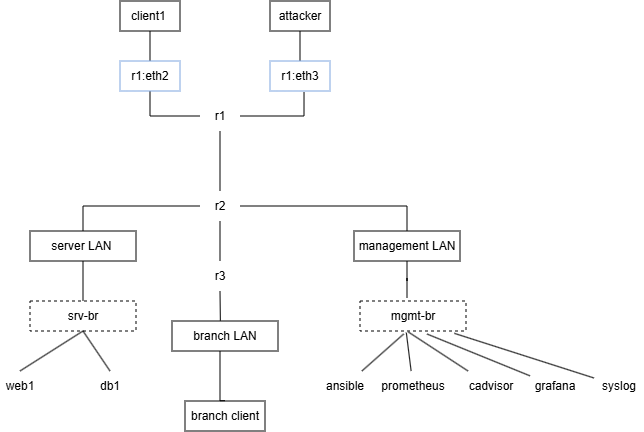

  # Viikko 1 – Verkon dokumentointi

  ## 1. Johdanto

  ## 2. Verkkokaavio

  

  ## 3. Laiteluettelo
  
| Laite | Rooli |
|---|---|
| r1 | Edge-reititin. Yhdistää User LAN:in (10.10.10.0/24, kaksi osiota: client1 ja attacker) runkoverkkoon (10.255.12.0/30 → r2). OSPF-alue 0, antaa oletusreitin (`default-information originate`) muulle verkolle, NAT ulos |
| r2 |  Core-reititin. Yhdistää serveriverkon, hallintaverkon ja r3. Kokoaa ja välittää sisäisiä verkkoja (server, management, branch)toisiinsa, mutta ei ole se piste josta mennään "ulos". |
| r3 | Branch-reititin. Yhdistää LAN:in (branch-client, 10.10.30.0/24) runkoverkkoon r2:n kautta. Ei OSPF-oletusreitti.|
| client1 | Tavallinen käyttäjätyöasema, osoite 10.10.10.101, User LAN:issa |
| attacker | Kali Linux -hyökkääjäkone |
| web1 | Web-palvelin (Server LAN) |
| db1 | Tietokantapalvelin (Server LAN) |
| branch-client | Sivutoimipisteen käyttäjä |
| ansible | Ansible-hallintanoodi. Hoitaa SSH-avaiten jaon muihin laitteisiin |
| prometheus | Metriikan keräys |
| grafana | Dashboardit/Datan visualisointi |
| zabbix | Valvonta-työkalu. Appliance-kontti. |
| cadvisor | Konttimetriikka |
| syslog | Lokipalvelin. 172.20.20.50 |
| NetBox | Erillinen Docker Compose -pino (ei containerlab-noodi). Source of Truth -dokumentaatiopalvelu IP-osoitteille ja laitteille. |
| mgmt-bp | Tekninen L2-silta-kontti |
| srv-bp | Tekninen L2-silta-kontti |

  ## 4. IP-suunnitelma

  | Verkko | Tarkoitus | Yhdyskäytävä |
  |---|---|---|
  | 10.10.10.0/24 | User LAN (client1) | r1 eth2 = 10.10.10.1 |
  | 10.10.10.0/24 (2. segmentti) | attacker-linkki | r1 eth3 = 10.10.10.254 |
  | 10.10.20.0/24 | Server LAN (web1, db1) | r2 eth2 = 10.10.20.1 |
  | 10.10.30.0/24 | Branch LAN | r3 eth2 = 10.10.30.1 |
  | 10.10.99.0/24 | Management LAN | r2 eth3 = 10.10.99.1 |
  | 10.255.12.0/30 | r1↔r2 runkolinkki | r1=.1, r2=.2 |
  | 10.255.23.0/30 | r2↔r3 runkolinkki | r2=.1, r3=.2 |
  | 172.20.20.0/24 | Containerlab-hallintaverkko (Docker), erillinen loogisesta verkosta
  | — |

  ## 5. Reitityksen analyysi

  ## 6. Yhteenveto