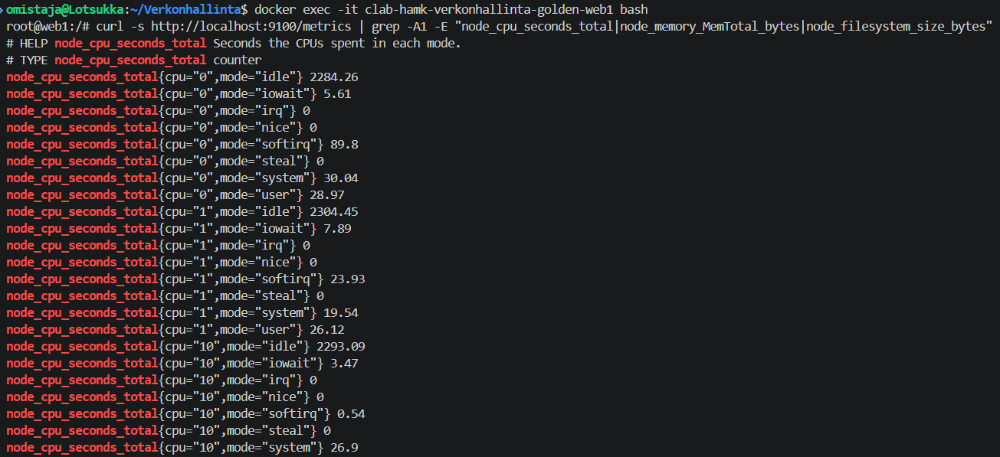
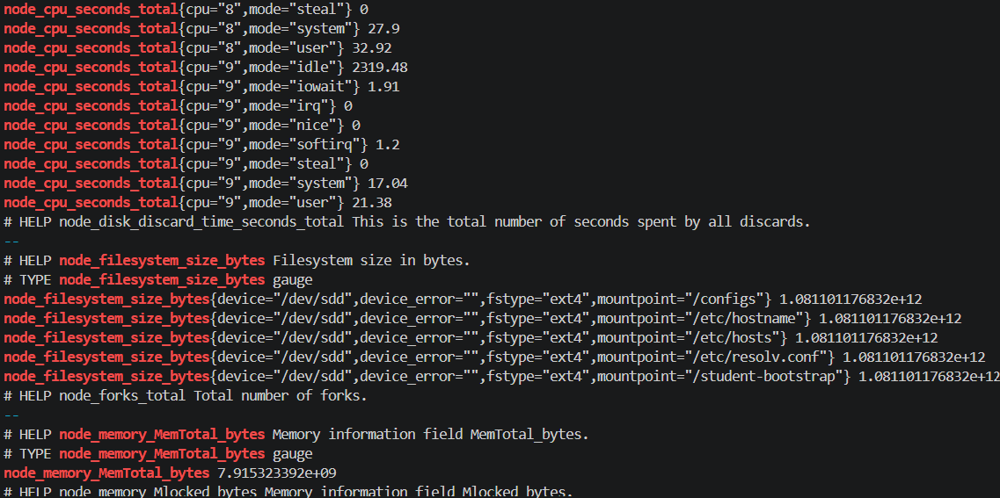
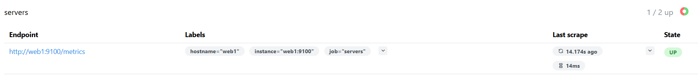
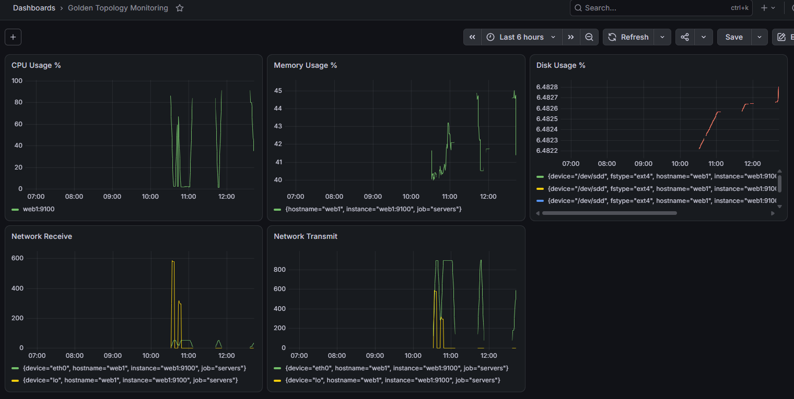
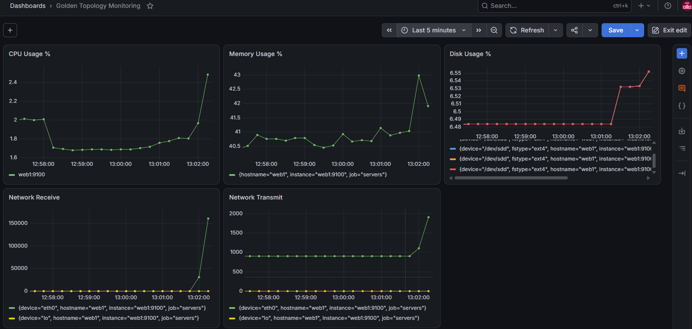
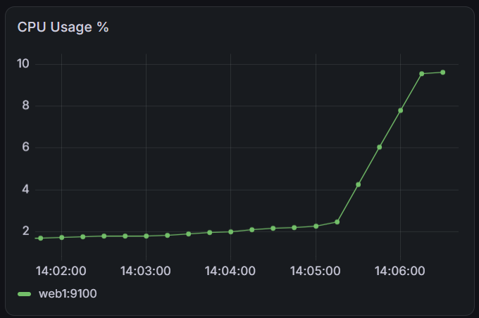

# Viikko 3 – Prometheus, Node Exporter ja Grafana

## 1. Johdanto

Monitorointi on järjestelmien, palveluiden ja verkkolaitteiden tilan ja suorituskyvyn jatkuvaa seurantaa mittaamalla ja keräämällä tietoa (esim. kuormaa, käytettävyyttä, virheitä) automaattisesti.

Monitorointi on olennainen osa palveluiden ja verkkojen ylläpitoa. Sen avulla ongelmat huomataan ajoissa, usein ennen kuin käyttäjät kärsivät niistä. Monitorointi mahdollistaa nopean vianetsinnän, kapasiteetin suunnittelun ja auttaa varmistamaan palveluiden käytettävyyden ja tietoturvan.

Prometheus on avoimen lähdekoodin monitorointi- ja hälytysjärjestelmä, joka kerää aikasarjamuotoista mittaustietoa (metriikkaa) järjestelmistä ja sovelluksista pull-periaatteella, ja jota käytetään usein yhdessä Grafanan kanssa datan visualisointiin.

## 2. Node Exporterin käyttöönotto

Ympäristöön web1-palvelimelle asennettiin Node Exporter. Se on agentti, joka kerää käyttöjärjestelmätason suorituskykytietoja (CPU-kuorma, muistin käyttö, levytila, verkkoliikenne) ja tarjoaa ne HTTP-rajapinnan (`/metrics`) kautta Prometheuksen luettavaksi.

Prometheus oli jo osa valmista kurssiympäristöä. Se kerää (scrapes) Node Exporterin tarjoamat mittarit säännöllisin väliajoin ja tallentaa ne aikasarjatietokantaansa.

Grafana, joka oli niin ikään valmiiksi ympäristössä, otetaan käyttöön kerätyn datan visualisointiin dashboardeilla.

Web1-koneelle kirjauduttiin ensin komennolla:

```bash
docker exec -it clab-hamk-verkonhallinta-golden-web1 bash
```

Konttiin asennettiin tarvittavat työkalut (wget, tar) pakettien lataamista ja purkamista varten:

```bash
apt update
apt install wget tar -y
```

GitHubin julkaisusivulta selvitettiin uusin saatavilla oleva versio (1.12.1), ladattiin se ja purettiin paketti:

```bash
wget https://github.com/prometheus/node_exporter/releases/latest/download/node_exporter-1.12.1.linux-amd64.tar.gz
tar xvf node_exporter-1.12.1.linux-amd64.tar.gz
cd node_exporter-1.12.1.linux-amd64
```

Node Exporter käynnistettiin suoraan komentoriviltä:

```bash
./node_exporter
```

Prosessi jätettiin käyntiin omaan terminaali-ikkunaansa, jotta agentti pysyy aktiivisena.

Toisessa terminaalissa (samaan konttiin sisään kirjautuneena) varmistettiin agentin toiminta:

```bash
curl http://localhost:9100/metrics
```

Tulosteessa näkyi lukuisia mittareita, kuten `node_cpu_seconds_total`, `node_memory_MemTotal_bytes` ja `node_filesystem_size_bytes`, mikä vahvisti Node Exporterin toimivan oikein.




## 3. Prometheus

Prometheus avattiin selaimessa osoitteessa http://localhost:9090. Käyttöliittymän valikossa kohta on nykyisin nimeltään **Targets Health** ja sieltä tarkistettiin, että `servers`-jobin alla `web1` näkyi kohteena ja sen tila oli **UP**, eli Prometheus onnistui keräämään mittarit Node Exporterilta.



## 4. Dashboard

Kirjauduin Grafanaan (http://localhost:3000) ja lisäsin Prometheuksen tietolähteeksi osoitteella http://prometheus:9090. Loin dashboardin ja sinne 5 paneelia eri tietojen seurantaa varten. Nämä tiedot haetaan PromQL-kyselyillä.


**CPU Usage %**
Kertoo kuinka suuri osa prosessoritehosta on käytössä.

**Memory Usage %**
Näyttää muistin käytön suhteessa kokonaismuistiin.

**Disk Usage %**
Levytilan käyttöaste.

**Network Receive / Transmit**
Kuvaa verkkoliikenteen määrää sisään/ulos. Piikit ovat normaaleja (esim. paketin lataus, käyttäjäliikenne).

Käyrät antavat baseline-tason eli "normaalin" kuvan järjestelmästä, ja poikkeamat baselinesta on helppo huomata visuaalisesti. Reaaliaikainen näkyvyys mahdollistaa ennakoivan reagoinnin (esim. levytila loppumassa) ennen kuin ongelma aiheuttaa katkon. Historiadata auttaa vianetsinnässä jälkikäteen: jos palvelu kaatui klo 14:32, voi katsoa mitä CPU/muisti/verkko teki juuri silloin ja löytää syyn nopeammin kuin lokitiedostoja selaamalla.



## 5. Kuormitustesti

Web1-palvelimelle aiheutettiin kuormitusta ja Grafanan dashboardia seurattiin reaaliajassa.

**CPU Usage %**
Testissä näkyi lyhyt, terävä piikki, ja järjestelmä palautui heti testin jälkeen. Ongelma on, jos käyrä pysyy jatkuvasti korkealla (esim. yli 80–90 %) pidemmän aikaa: silloin palvelin on ylikuormittunut ja palvelut voivat hidastua.

**Memory Usage %**
Testin aikana näkyi lyhyt piikki. Lyhyet piikit ovat normaaleja (ohjelmat varaavat ja vapauttavat muistia). Vaarallista on tasaisesti nouseva, ei koskaan laskeva käyrä, joka voi viitata muistivuotoon (memory leak), joka lopulta kaataa palvelun.

**Disk Usage %**
Testin aikana levyn käyttöaste nousi ja jäi ylös. Käyttöastetta kannattaa seurata trendinä pitkällä aikavälillä: jos käyrä nousee tasaisesti viikkojen kuluessa, levy täyttyy ennen pitkää ja pitää reagoida ennakoivasti.

**Network Receive / Transmit**
Testin aikana verkkoliikenteen kasvu näkyi jyrkkänä piikkinä. Piikit ovat normaali ilmiö esimerkiksi latausten tai käyttäjäliikenteen yhteydessä, mutta jatkuvasti epätavallisen korkea liikennemäärä voisi viitata esimerkiksi DDoS-hyökkäykseen tai virheellisesti toimivaan sovellukseen.




## 6. SNMP vs Prometheus

Prometheuksella on useita etuja verrattuna SNMP:hen. SNMP on vanha (1988) pull-pohjainen protokolla, jossa hallintajärjestelmä kyselee laitteilta MIB-muuttujia (Management Information Base). Se toimii hyvin verkkolaitteissa (reitittimet, kytkimet), mutta siinä on rajoitteita: jäykkä ja laitevalmistajakohtainen tiedon rakenne, heikko turvallisuus vanhemmissa versioissa, huono skaalautuvuus sekä laitteita ja verkkoja kuormittava toiminta.

Prometheus on moderni pull-pohjainen monitorointijärjestelmä, joka on suunniteltu erityisesti pilvi- ja konttiympäristöihin. Moniulotteinen tietomalli mahdollistaa joustavan suodatuksen, ja PromQL-kyselykieli mahdollistaa monimutkaisen analytiikan suoraan tietokannasta. Service discovery tunnistaa automaattisesti uudet kohteet (esim. Kubernetes-podit), mikä sopii dynaamisiin ympäristöihin paremmin kuin SNMP:n staattiset laitelistat. Muita etuja ovat avoin ja laajennettava ekosysteemi, sisäänrakennetut hälytys- ja visualisointi-integraatiot (esim. Grafana) sekä mahdollisuus kerätä metriikkaa verkkolaitteiden lisäksi myös sovellustasolta.

| Ominaisuus | SNMP | Prometheus |
|------------|------|------------|
| Tiedonkeruu | Laitteella pyörii agentti (snmpd), joka vastaa kyselyihin (esim. snmpget, snmpwalk). Pull-pohjainen, UDP/OID-dataa. | node_exporter julkaisee mittarit HTTP-osoitteessa /metrics, ja Prometheus-palvelin hakee (scrape) ne säännöllisesti. Pull-pohjainen, käyttää HTTP:tä ja tekstimuotoista dataa. |
| Käyttöönotto | Yksi konfiguraatiotiedosto per laite (/etc/snmp/snmpd.conf), mutta oletusasetukset olivat rajoittavia. | Enemmän osia asennettavana (node_exporter jokaiselle koneelle + Prometheus-palvelin + Grafana), mutta kun kerran pystyssä, uusien kohteiden lisäys on helppoa. |
| Mittarien määrä | Rajoittuu MIB-tiedostoissa määriteltyihin mittareihin, usein suppeampi ilman lisä-MIBejä. | node_exporter tarjoaa paljon valmiita mittareita heti (/metrics-tuloste). |
| Visualisointi | Ei sisäänrakennettua graafista näkymää, tarvitsee erillisen työkalun. | Sisäänrakennettu graafinen web-UI + natiivi Grafana-integraatio. |
| Hälytysmahdollisuudet | SNMP-trapit voivat ilmoittaa tapahtumista, mutta hälytysjärjestelmä pitää rakentaa erikseen. | PromQL-säännöt + Alertmanager-komponentti. |
| Soveltuvuus pilviympäristöihin | Suunniteltu staattisille, pysyville verkkolaitteille ja sopii siten huonosti dynaamisiin, nopeasti muuttuviin pilvi-/konttiympäristöihin. | Suunniteltu alun perin juuri dynaamisille, kontittuneille ympäristöille ja tukee automaattista kohteiden löytämistä (service discovery). |

Käytännössä SNMP on yhä vahva verkkolaitteiden (reitittimet, kytkimet, tulostimet) valvonnassa, kun taas Prometheus loistaa palvelin-, sovellus- ja mikropalveluympäristöissä. SNMP:tä ja Prometheusta voi hyvin käyttää rinnakkain, ja SNMP-exporter voi jopa tuoda SNMP-datan Prometheukseen.

## 7. Yhteenveto

Tämän harjoituksen aikana rakensin ensimmäisen modernin monitorointiratkaisuni kurssiympäristöön ja pääsin vertailemaan sitä aiemmin tutuksi tulleeseen SNMP:hen. Lähdin liikkeelle asentamalla Node Exporter -agentin web1-palvelimelle jo valmiiksi ympäristössä olevien Prometheuksen ja Grafanan rinnalle. Asennus onnistui lataamalla uusin versio suoraan GitHubin julkaisusivulta, purkamalla paketti ja käynnistämällä agentti komentoriviltä, minkä jälkeen varmistin toiminnan curl-komennolla porttiin 9100. Tulosteessa näkyi mm. node_cpu_seconds_total ja node_memory_MemTotal_bytes, mikä osoitti agentin toimivan odotetusti. Tämän jälkeen tarkistin Prometheuksen web-käyttöliittymästä, että web1-kohde näkyi tilassa UP, ja lisäsin Prometheuksen tietolähteeksi Grafanaan, jonne rakensin viiden paneelin dashboardin CPU-, muisti-, levy- ja verkkoliikennemittareille PromQL-kyselyiden avulla.

Ylläpitäjän kannattaa seurata jatkuvasti neljää perusasiaa: CPU-käyttöä, muistin käyttöä, levytilaa ja verkkoliikennettä. Näiden lisäksi on hyvä tarkkailla palvelun saatavuutta (toimiiko palvelu ylipäätään) sekä virheiden määrää ja vasteaikoja. Tärkeintä on erottaa normaali vaihtelu poikkeamasta: lyhyet piikit ovat yleensä harmittomia, mutta pitkään jatkuva korkea kuorma, tasaisesti nouseva muistinkäyttö tai levytilan jatkuva täyttyminen ovat merkkejä ongelmasta, johon pitää reagoida.

Jatkokehityksenä lisäisin dashboardiin hälytysrajat (esim. CPU/muisti/levy yli 90 %), jotta ongelmasta tulee automaattinen ilmoitus,
sovellustason mittarit, kuten virheiden määrän ja vasteajan sekä verkkovirheet ja pudonneet paketit, koska pelkkä liikennemäärä ei kerro kaikkea verkon kunnosta.

Kuormitustestit olivat harjoituksen havainnollisin osuus, koska niiden avulla pystyin näkemään konkreettisesti, miten eri resurssit reagoivat kuormitukseen reaaliajassa. CPU-kuormitus näkyi dashboardilla terävänä, lyhytkestoisena piikkinä, joka palautui heti testin päätyttyä, kun taas jatkuvasti korkealla pysyvä käyrä olisi merkki todellisesta ylikuormituksesta. Muistin käytössä lyhyet piikit osoittautuivat normaaleiksi, sillä ohjelmat varaavat ja vapauttavat muistia jatkuvasti, mutta opin tunnistamaan, että tasaisesti nouseva ja koskaan laskematon käyrä olisi hälytysmerkki mahdollisesta muistivuodosta. Levytilan testissä käyttöaste nousi ja jäi pysyvästi ylemmälle tasolle, mikä havainnollisti, miksi levytilaa kannattaa seurata nimenomaan pitkän aikavälin trendinä eikä vain hetkellisenä arvona. Verkkoliikenteessä testi aiheutti jyrkän piikin. Piikit ovat normaali ilmiö esimerkiksi latausten tai käyttäjäliikenteen yhteydessä, mutta jatkuvasti epätavallisen korkea liikennemäärä voisi viitata esimerkiksi DDoS-hyökkäykseen tai virheellisesti toimivaan sovellukseen.

Harjoitus vahvisti ja täydensi luennolla opittua teoriaa ja vei sen käytännön tasolle. Dashboard antaa baseline-tason eli kuvan järjestelmän normaalista käyttäytymisestä, jolloin poikkeamat on helppo huomata visuaalisesti, ja reaaliaikainen näkyvyys mahdollistaa ennakoivan reagoinnin ennen kuin ongelma ehtii aiheuttaa varsinaisen katkon. Myös historiadatan hyöty jälkikäteisessä vianetsinnässä havainnollistui: jos palvelu kaatuisi tiettynä ajanhetkenä, dashboardilta näkisi nopeasti, mitä CPU, muisti ja verkko tekivät juuri sillä hetkellä, mikä nopeuttaisi syyn löytämistä huomattavasti verrattuna pelkkien lokitiedostojen selaamiseen. Lisäksi harjoitus syvensi ymmärrystäni siitä, miksi Prometheus soveltuu SNMP:tä paremmin nykyaikaisiin, dynaamisiin ympäristöihin. Moniulotteinen tietomalli, PromQL-kyselykieli, automaattinen kohteiden tunnistus (service discovery) sekä sisäänrakennetut integraatiot Grafanaan ja Alertmanageriin tekevät siitä joustavamman ja skaalautuvamman ratkaisun kuin jäykkä, laitevalmistajakohtaisiin MIB-tiedostoihin nojaava SNMP. Samalla tuli selväksi, että kumpikin teknologia voi elää rinnakkain.


